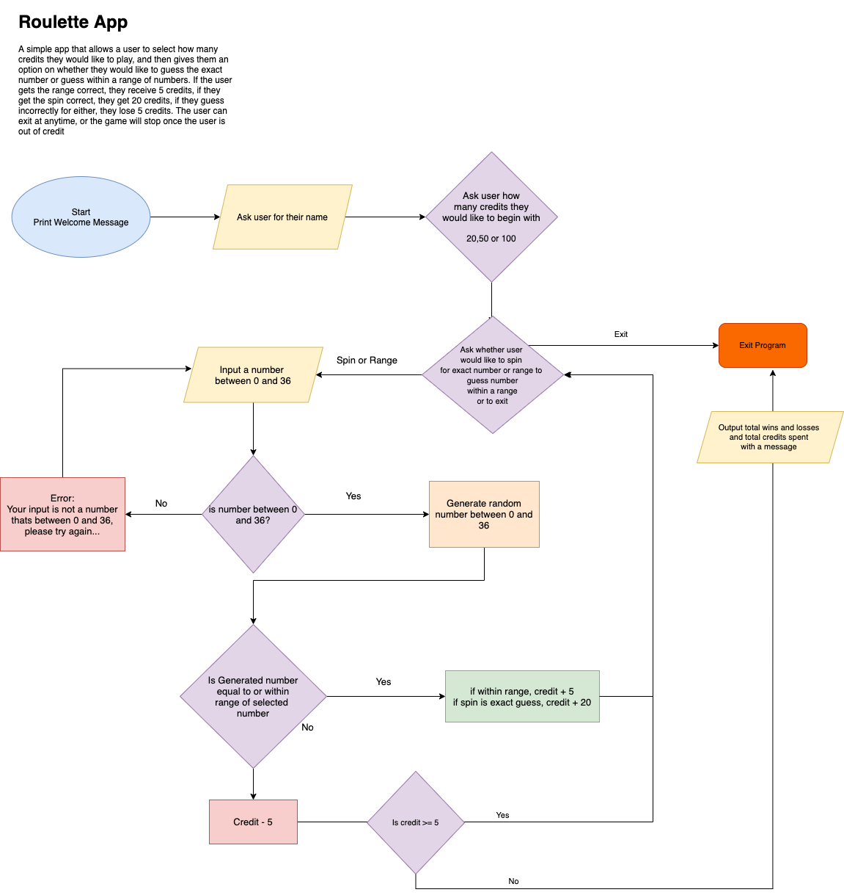

# Welcome to my Roulette App

This is a simple Terminal app developed in Ruby, that allows the user to play a Roulette styled game.

### Key points:
*  The app allows a user to start off the game with a credit of their choice.
* It asks the user to input any number from 0-36.
* If the user guesses the number correctly, they earn 20 additional credits.
* If they guess incorrectly, their credit decreases by 5.
* The game will cycle through once and finish if user runs out of credit or if the user exits the game.
* User can exit the game from the menu selection at any time.

## You can visit the Repository here:

## [Roulette App - Repository](https://github.com/Krishtronomy/roulette-app)

- [Software Development Plan](#software-development-plan)
- [Features](#features)
- [Outline](#outline)
- [Control Flow Diagram](#control-flow-diagram)
- [Help Documentation](#help-documentation)
- [System Requirements](#system-requirements)

## [Software Development Plan](#software-development-plan)
### Purpose and Scope:
The Roulette Application is a text based game written in Ruby and run on the Terminal interface. The game will allow a user to guess a number between 0 and 36, they can attempt to guess the exact number by selecting `spin` or select a number between the ranges of `0-12`, `13-24` or `25-36` by selecting the `range` option.

The game is designed as a means of entertainment and to cure boredom. Although the bigger issue it is trying to solve is gambling addiction and knowing when to stop. Once the  user starts the game, it can be extremely addictive to keep wanting to guess the correct number. After multiple attempts, the likeliness of the user ending up with more credit than they began with is highly unlikely. This is to raise awareness that although it is extremely addictive and fun, it can be very easy to lose in a very short amount of time. This will then hopefully help the user internally translate this message into the real word to help with any urges or addictions they have, to help them to stop. 

For the above reasons, my main target audience is aimed at people who have addictions around gambling, but it is also just a fun little game that can be used by anyone to cure boredom.

Upon designing the application, I have attempted to make the game as user and beginner friendly as possible; realising the fact that my target audience may not be tech savvy. In my Github repository, I have tried to lay out the instructions as clearly as possible so as to help the user understand and operate the game with ease.

## [Features](#features)
### 1.  Random Number Generator:
The random number generator is a feature that randomises and outputs any number between 0 and 36. This feature is created using the `rand` method which randomises the number each time a selection is made by the user.

### 2. Number Range Validator
The number range validator validates whether if the user entered number matches with the randomised number. The validator determines whether the user selects `spin` and it will see if both numbers match exactly, or if the user selects `range` then it will check if the the user entered number is within the range of the randomised number (ie. random generated number is `7` which puts this in the range of `0 - 12`, and user had selected number `2`, the result will then return the validation as true as it is within range) This is achieved using if/else control flow to validate the correct result.

### 3. Number History Viewer
The number history viewer is a feature that pushes all the elements from the number randomiser into a new array and stores them. This number history viewer is then outputted to the screen, allowing the user to visibily see the list of numbers that has been struck allowing them to perhaps notice a trend and help decide on what number to pick next.

### 4. Total Spent
The total spent feature is method which calculates the amount of turn the players has staked a credit. It calculates this by utilising the `win` and `loss` arrays which gets populated each turn. The method then takes the count of both arrays and multiplies this by 5(total stake per turn) and returns the value. Depending on the total amount lost, the user will get printed a message suggesting how the credit could've been used otherwise.

## [Outline](#outline)
- The user will find out how to interact with each feature by going through the documentation of the app. I will also implement Command line arguments with help flags that will very clearly outline the instructions on how to use each feature. The design of the app is meant to be very user friendly so it will require minimum effort to know how to navigate the app.

- The user will mostly interact with menu options and their keyboard to type input where required. The menu options will be added using a Ruby Gem called `tty-prompt ` which will help me implement an easy to navigate menu within the terminal.

- Errors will be captured through control flow using `if/else` and `case statements` to help prevent the app from crashing from any incorrect input by the user. Alongside this, the app will utilise `raise` to raise errors in the event of unexpected input and then use `begin`, `rescue` and `retry` to allow the user to loop back retry the input again without crashing the app. I will use inheritance to create custom error type 
messages and then print this to the user indicating the error in a graceful manner.

## [Control Flow Diagram](#control-flow-diagram)

Below is the Control flow digram for the application:

## [Help Documentation](#help-documentation)

### Installation
1. You will first need to `cd` into the `src` directory to be able to run the below installation shell script file.
2. You may need to give the appropriate permissions to the `install_dependencies` file so it can be run on your system. To do this, you can run the following in your Terminal:

`chmod +x ./install_dependencies.sh`

3. Once you have given permission and are in the `src` directory, you can run the below script to install the required dependencies:

`./install_dependencies.sh`

    
### Executable file

You will firstly need to `cd` into the `src` directory. 
You can run the app using the `ruby main.rb` command, or alternatively you can use `run_app.sh` bash shell script file:

1. You may need to give the appropriate permissions to the run_app.sh file so it can be run on your system. To do this, you can run the following in your Terminal:

`chmod +x ./src/run_app.sh`

2. Run the below command in your Terminal window to execute the program:

`./run_app.sh`

##  [System Requirements](#system-requirements)
### Minimum Requirements:

* 64-bit Operating System
* 1.2GHz Processor or faster
* 2GB RAM
* 1GB of Disk Space

### Supported Operating Systems
* MacOS
* Windows
* Linux

 
